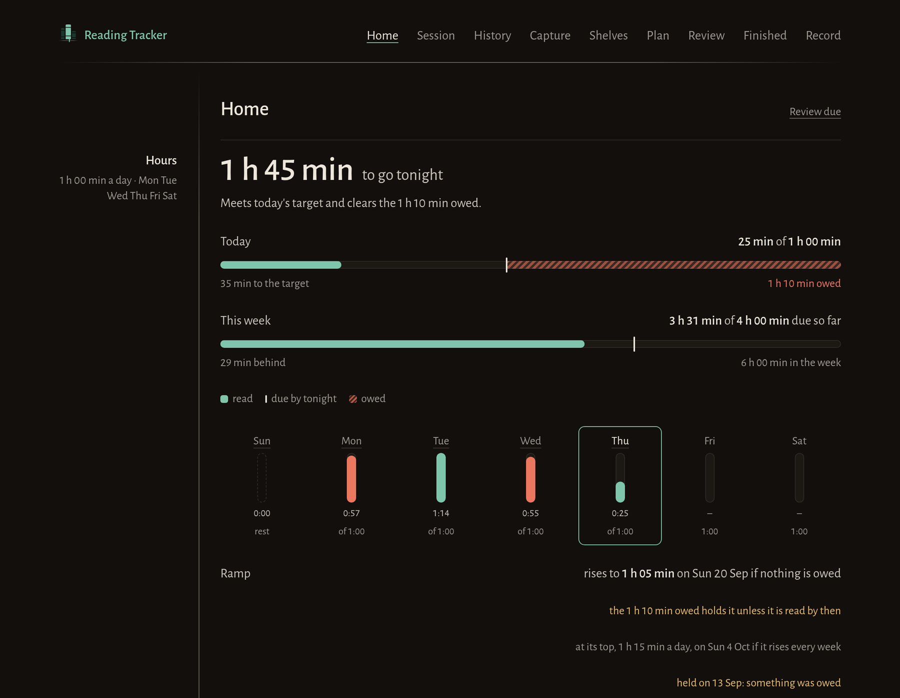
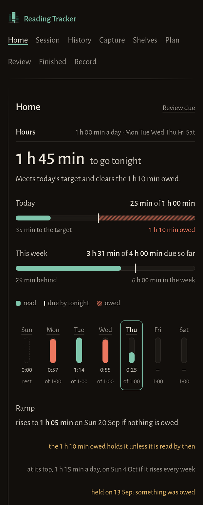
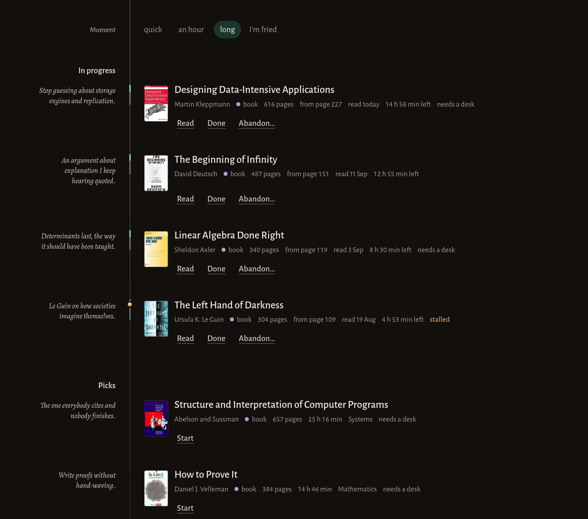
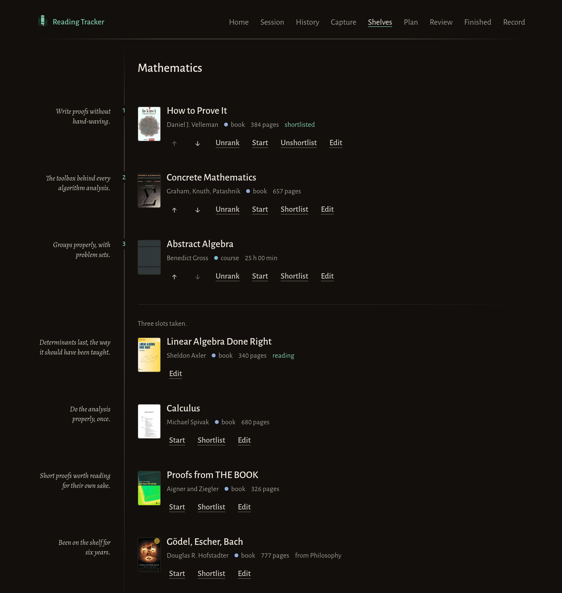
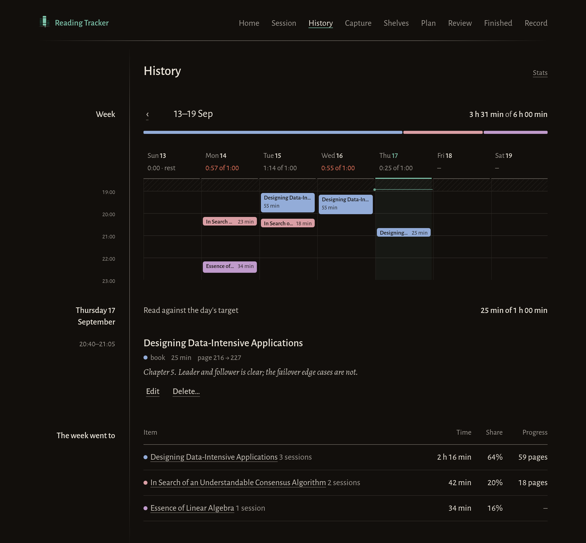
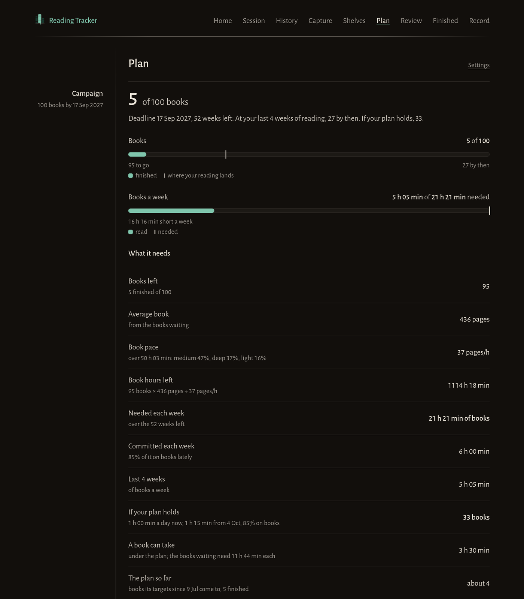
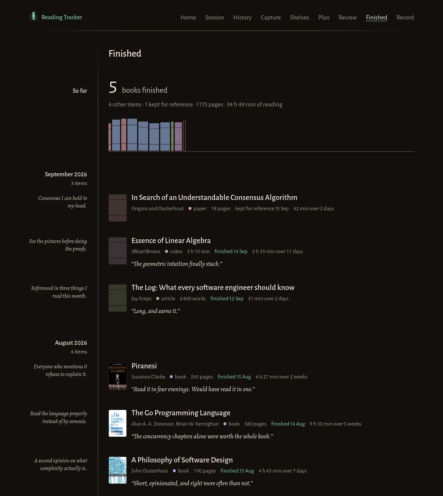

<div align="center">
  
  <p><strong>Decide what to read next, and hold a reading discipline over a year.</strong></p>
  <p>One Go binary, one SQLite file. No account, no cloud, nothing in the browser.</p>
</div>



Most reading tools show you the whole library, and a tidy list of 200 items still makes it hard to pick one. This one works the other way round:

- **It hides things.** Home shows where you stand, what you are reading, and a short weekly shortlist. The rest stays out of the way until you go looking.
- **It fits the moment.** Twenty minutes in bed and three hours at a desk call for different things. Every item has a shape — format, length, how much focus it needs — and Home filters by the moment you actually have.
- **It keeps the numbers honest.** Any figure that could drift in a flattering direction is shown next to whatever explains the drift. Reading speed never appears without the mix of material behind it.

> Built with AI, for one person's use. There is no login and no multi-user story. Run it on your own machine and keep your own backups.

---

## Run it

You need **Go 1.25 or newer**. Nothing else — SQLite is pure Go, so there is no C compiler and no system library to install.

```sh
git clone https://github.com/fran-dv/Reading-Tracker
cd Reading-Tracker
go run ./cmd/readingqueue
```

Then open **<http://127.0.0.1:8080>**. The database is created on first start at `~/.local/share/readingqueue/readingqueue.db`, and its schema is upgraded automatically on every later start.

That is the whole thing. For daily use, [run it as a service](#run-it-as-a-service) so it is always there.

### Options

| Flag       | Default                                       | Meaning                                              |
| ---------- | --------------------------------------------- | ---------------------------------------------------- |
| `-addr`    | `127.0.0.1:8080`                              | Address to listen on                                 |
| `-db`      | `~/.local/share/readingqueue/readingqueue.db` | Database file; created if missing                    |
| `-import`  |                                               | Load a JSON export into an empty database, then exit |
| `-version` |                                               | Print the version and exit                           |

The binary is called `readingqueue`, the project's working name.

### From your phone

The app only listens on your machine, and **it has no login**, so never expose it to the internet. To read on your phone, put both devices on a private network — [Tailscale](https://tailscale.com) is the easy way — and listen on that interface:

```sh
readingqueue -addr 100.x.y.z:8080
```

Then add it to the home screen: it installs as a PWA, and only the app shell is cached, so the data you see always comes from the server.



---

## The screens

<sub>Screenshots use a synthetic sample library, not anyone's real reading.</sub>

**Home** — what you are reading, then a handful of picks for the moment you have. Each one carries the one-line _why_ you wrote when you filed it, and the moment filter narrows them to what fits right now.



**Shelves** — three ranked slots, then the pool. An item tagged with another shelf's name also stands on that shelf, marked _borrowed_; nothing is duplicated.



**History** — every session on a week grid, on an axis that squeezes the hours nothing was ever read in, with the day's sessions and the week's ledger below.



**Plan** — your commitments, and every number that follows from them written out, including how far short of the goal your current pace lands.



**Finished** — what you gained. A shelf of spines, then each item's opening _why_ beside its closing _verdict_.



Not shown: capture, the session timer, the weekly review, the record of goals, stats and settings.

---

## How it works

**Items and shelves.** An item is a `book`, `article`, `paper`, `video` or `course`. Filing one asks for a shelf and a one-line _why_ — the only deliberate friction in the app, and the thing that makes pruning possible later. Each shelf keeps three ranked slots; everything else on it is an unordered pool. Items move forward only: pool → in progress → finished, reference or abandoned. Five at once, by default, and at the cap you must close something before starting another.

**Sessions.** Either run the timer, which lives on the server so closing the tab loses nothing, or enter a session after the fact — the normal path for a paper book read away from any screen. Both are first class. Durations are typed the way you say them and read back as you type: `1h30`, `1:30`, `1.5h` and `90` all mean ninety minutes.

**Estimates.** From the positions you note, the app measures your pace per item and per kind of material, and uses it for how long each thing has left. With no evidence it falls back to a default and says so. An item untouched for two weeks is marked _stalled_.

**The plan.** Pick your active days and a daily target, fixed or rising each week. Whatever you read short of the target is added to what you owe; reading beyond it pays that down, and surplus is never banked. Debt cannot be edited or forgiven — it is recalculated from your sessions every time, so a session entered late corrects the past. An hours ramp rises only in a week that starts owing nothing. A speed ramp raises a reading-speed target, measured by a speed index that compares each kind of material only with its own baseline, so lighter reading cannot inflate it.

**The campaign.** One goal, such as _100 books by 17 Sep 2027_. The plan shows the books so far, where the current pace lands, the weekly hours of book reading the goal needs, and how that compares with what you have committed to.

The full specification — every screen, rule and number — is [`docs/SPEC.md`](docs/SPEC.md).

---

## Your data

Everything lives in one directory:

```
~/.local/share/readingqueue/
├── readingqueue.db                     the database
└── backups/
    ├── readingqueue-2026-09-17.db      automatic daily backups
    └── pre-deploy-53a0311.db           copies taken by deploy.sh
```

Once a day the app writes a consistent copy of the database and keeps the last 14 daily and 8 weekly ones. Pre-deploy copies are never removed automatically.

```sh
# Export everything as JSON: shelves, items, tags, sessions, plan, campaigns, settings.
curl -o reading-export.json http://127.0.0.1:8080/export

# Import into an empty database.
readingqueue -db ~/.local/share/readingqueue/readingqueue.db -import reading-export.json
```

Backups sit on the same disk as the database, so copy `backups/`, or a regular export, somewhere else if you want to survive losing the machine.

All timestamps are stored in UTC. Days and weeks follow the timezone in settings, which defaults to the machine's.

---

## Run it as a service

For daily use the app runs in the background as a systemd **user** service — as you, without root, started at login. That suits an app whose data lives in your home directory. The unit is [`deploy/readingqueue.service`](deploy/readingqueue.service), and it assumes `go install` puts binaries in `~/go/bin`.

Installing and updating are the same command:

```sh
make deploy
```

It refuses to run with uncommitted changes, so what runs is always a commit; then it runs the tests, installs the binary, copies the database to `backups/pre-deploy-<commit>.db`, and restarts the service. Reload the page afterwards.

```sh
systemctl --user status readingqueue     # is it running, and since when
systemctl --user restart readingqueue    # restart it
journalctl --user -u readingqueue -f     # follow its logs
```

### Rolling back

Schema upgrades only go forward, so rolling back means restoring the copy taken just before the bad update and running the commit you were on before it:

```sh
data=~/.local/share/readingqueue

systemctl --user stop readingqueue
cp "$data/backups/pre-deploy-<commit>.db" "$data/readingqueue.db"
rm -f "$data/readingqueue.db-wal" "$data/readingqueue.db-shm"

git checkout <commit>
make deploy
```

When the problem is fixed, `git checkout main` and deploy again.

---

## Development

The everyday commands are in the `Makefile`. All of them use a separate port and the ignored `.dev/` directory, so the app you actually read with is never the one being changed:

```sh
make dev      # http://127.0.0.1:8081, on .dev/readingqueue.db
make lan      # the same, reachable from the phone on this network
make test     # go test ./...
make check    # formatting, vet and tests: run before committing
make deploy   # install the current commit as the app you use
```

Templates, styles, fonts and scripts are embedded in the binary, so `make dev` has to be restarted to see a change to any of them; only the database is live.

Two rules keep the running app safe: deploy only committed work with passing tests, which `make deploy` enforces, and never edit a migration that has already been committed — schema changes go in a new file under `internal/sqlite/migrations/`.

```
cmd/readingqueue/     entry point: flags, server, shutdown
internal/library/     domain logic: items, shelves, sessions, pace, debt, ramps, campaign
internal/sqlite/      storage and migrations
internal/web/         HTTP handlers, templates and static assets
internal/metadata/    URL and Open Library lookups
internal/covers/      fetching and holding item covers
internal/backup/      daily backups and retention
deploy/               systemd unit and deploy script
docs/SPEC.md          the specification
```

The domain logic imports no HTTP, template or Datastar code and is tested with `go test` alone; date arithmetic is tested against a fixed clock.

**Stack.** Go standard library, SQLite via [`modernc.org/sqlite`](https://pkg.go.dev/modernc.org/sqlite), and [Datastar](https://data-star.dev) with its Go SDK. Pages are rendered on the server and updated with HTML fragments over server-sent events. There is no JSON API, no client framework and no browser storage.

---

## Status

Every step of the build order in [`docs/SPEC.md` §12](docs/SPEC.md#12-build-order) is built, and the app is in daily use. Work now comes from using it: the audit of what the first version got wrong, and the gaps that only show up after a few weeks of real reading.
